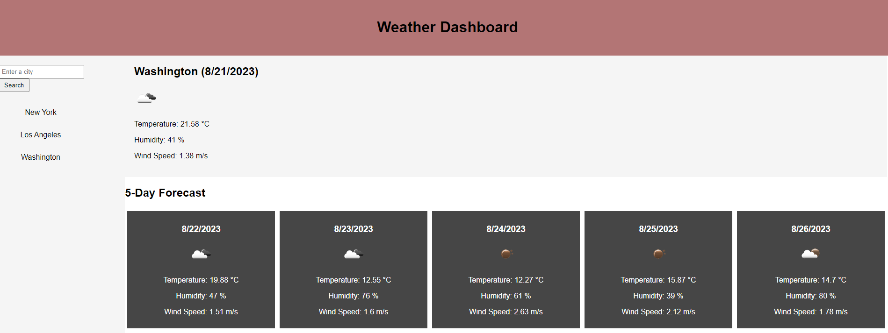

# Weather Dashboard

## Description
Create a website pulling from a third party weather app presenting the weather for a city provided by the user. 
undefined

## Table of Contents
- [Installation](#installation)
- [Usage](#usage)
- [License](#license)
- [Contributing](#contributing)
- [Testing](#testing)
- [Questions](#questions)

## Installation
NA

## Usage
[Github repo](https://github.com/Jako0320/JS-WeatherDashboard)  
[Live Website](https://jako0320.github.io/JS-WeatherDashboard/)  

## License

  
This application is not covered under any license.

## Contribution
Classes and Third party documentation.

## Testing
NA

## Questions
Please feel free to reach out for any questions:
- GitHub: https://github.com/jako0320
- Email: jacques.scoffoni@gmail.com
